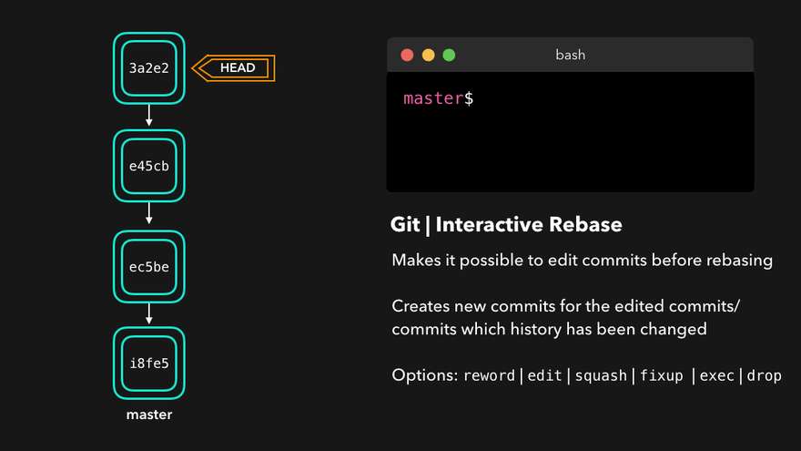

# Git Guide

In general, git usage is explained visually. Each topic is explained by giving examples.

#### Merging

Having multiple branches is incredibly useful for maintaining separation between different sets of changes and ensuring that unapproved or broken changes are not accidentally pushed to production. Once the changes have been approved, it's important to incorporate these changes into the production branch.

<span style="color:yellow">One way to accomplish this is by performing a git merge.</span> Git offers two types of merges: fast-forward and no-fast-forward.

- No Fast-forward
- Fast-forward

#### Fast-forward (--ff)

A fast-forward merge occurs when the target branch (in this case, the master branch) hasn't received any new commits since the source branch was created. In such cases, Git simply moves the pointer of the target branch (dev) to point at the latest commit from the source branch. This results in a linear history without any merge commits.

To perform a fast-forward merge:

1. Switch to your target branch (e.g., master): `git checkout master`
2. Merge your source branch into the target branch: `git merge dev`
3. Push your changes to update the remote repository: `git push origin master`


The git `merge` command is run with `--ff` by default. If it can do a fast-forward merge, it can do it. If it cannot, non-fast-forward merge is performed.

The difference between rebase operation and merge operation is this; when a rebase operation is performed, copies of the commits from the source branch are applied onto the target branch, resulting in new commits. These new commits represent the history of the source branch but with different SHA values. As a result, the old commits are not deleted, but access to the original commits in history is provided directly through these new commits on the target branch. Therefore, after a rebase operation, Git history can appear more organized and a more linear structure can be achieved.

##### Example


The `HEAD` pointer is pointing to commit number `3898497` on our `master` branch. After creating the `dev` branch, no new commits have been made to the `master` branch. Since it remains in its initial state, we expect the fast forward operation to occur here.


When we execute the `git merge dev` command, it says that a fast-forward operation occurred. In the Updating line, it states that the `HEAD` pointer moved from commit number `3898497` to commit number `c1b23f3`.


As seen, the merge operation was performed by simply moving the `HEAD`. No merge commit is visible in the history.

#### No-Fast-forward (--no-ff)

When the current branch contains commits that the branch we want to merge lacks, <span style="color:yellow">to clarify, this means that new commits have been added on top of the master branch since we created the branch</span>. Git executes a non-fast-forward merge.

In a non-fast-forward merge, Git generates a new merge commit on the active branch. This commit's parent commits point to both the active branch and the branch we want to merge!


We've added the changes we made in our dev branch to our master branch with an additional merge commit.

##### Example


The Git branching is as depicted above. As observed, after the creation of the dev branch, a new commit was added to the master branch.

 If you run the `git merge dev` command,


We weren't expecting it to perform a fast-forward merge anyway.


The changes in the `dev` branch were moved to `master` with an additional merge commit.

I wish it were that easy :).

This example is entirely based on the assumption that two branches work on different files. But what if the commit in the master branch changes the same part of the same file as the commit in the dev branch?

#### Merge Conflicts

Although Git is good at deciding how to merge branches and add changes to files, it cannot always make this decision all by itself. This can happen when the two branches we're trying to merge have changes on the same line in the same file, or if one branch deleted a file that another branch modified, and so on.

In that case, Git will ask you to help decide which of the two options we want to keep! Let's say that on both branches, we edited the first line in the `README.md`.


If we want to merge `dev` into `master`, this will end up in a merge conflict: would you like the title to be `Hello!` or `Hey!`?

When trying to merge the branches, Git will show you where the conflict happens. We can manually remove the changes we don't want to keep, save the changes, add the changed file again, and commit the changes 🥳


Yay! Although merge conflicts are often quite annoying, it makes total sense: Git shouldn't just assume which change we want to keep.

##### Example


The scenario where they change the same file is provided above. They each have a commit that modifies the same file.


As seen, a conflict warning has been issued. You need to resolve it manually. `VS Code` provides a greatly simplified interface for this.


It has highlighted the changes and indicates which branch made each change.

After resolving the conflict and saving, the file needs to be committed again.


This is the final view. The changes were added to our `master` branch with a merge commit.

#### Rebasing

Another method of incorporating changes from one branch to another is through git rebase. During a git rebase, the commits from the current branch are duplicated and placed on top of the designated branch.

This is often used to place the subsequent changes of one branch onto the changes of another branch. It's a useful tool for achieving a clean and organized history. However, rebase should be used carefully as it alters the history of a branch, potentially disrupting collaboration within a team where others are working on the branch.


Perfect, we now have all the changes that were made on the master branch available on the dev branch! 🎊

A big difference compared to merging, is that Git won't try to find out which files to keep and not keep. The branch that we're rebasing always has the latest changes that we want to keep!, and keeps a nice linear Git history.

This example shows rebasing on the master branch. In bigger projects, however, you usually don't want to do that. A git rebase changes the history of the project as new hashes are created for the copied commits!

Rebasing is great whenever you're working on a feature branch, and the master branch has been updated. You can get all the updates on your branch, which would prevent future merging conflicts! 😄

##### Example

What we want to do is to take the commits made after us on the master branch and add our commits from the dev branch to the end, ensuring that we don't lose our latest commits. In this case, the only solution left is overwriting.

First, let's move on to our dev branch.

```shell
git checkout dev # or git switch dev
```
Let's look at the final view of the branching.


Let's run the rebase command

```shell
git rebase master
```


Conflicts can be inevitable, especially when merging changes from different branches. However, the rebase operation often reduces or resolves conflicts by allowing you to add your changes later, resulting in a cleaner history. If you encounter conflicts, manual resolution may be required, but the rebase typically facilitates the conflict resolution process, leading to a more consistent history.


Looks perfect :)

#### Interactive Rebase

Interactive rebase in Git is used to rearrange past commits. During this process, the git rebase command presents a list detailing past operations. Users review each operation and can reorganize, merge, edit, or remove them as necessary.

Interactive rebase can be beneficial in various scenarios:

- **Combining Commits:** You can merge multiple small commits into fewer, more meaningful ones. `squash` or `fixup`
- **Editing Commit Messages:** It allows you to correct or make commit messages more descriptive. `reword`
- **Reordering Commits:** You can rearrange your commits in the desired order.
- **Amending Commits:** It enables you to change or fix a past operation . `edit`, `drop`

Interactive rebase is initiated with the git rebase -i command. This command opens a text editor, providing users with a series of commands and options to manage the rebase process. Users can customize and make desired changes by editing this file.

However, it's important to remember that interactive rebase alters past operations and should be used with caution. Altering history can impact other developers, especially when working on a shared repository. Therefore, it's generally safer to use interactive rebase in your own branch or personal workspace.

Awesome! This way, we can have full control over our commits. If we want to remove a commit, we can just drop it.



Or if we want to squash multiple commits together to get a cleaner history, no problem!


Interactive rebasing gives you a lot of control over the commits you're trying to rebase, even on the current active branch!

##### Example


Let's try to squash the commits with the numbers `4599113` and `656afbc`.

```shell
git rebase -i HEAD~3 # or a862d7b instead of HEAD~3
```

When we look at the list of commits, if we rebase against the commit three below, we can see the two commits we want to merge.


We wrote `squash` instead of `pick`. This means merge with the above commit.
Then, save and close the file


Another window opened automatically. Here you can change the message of the commit we `squash`.
Then, save and close the file


If we look at the final state of branching

